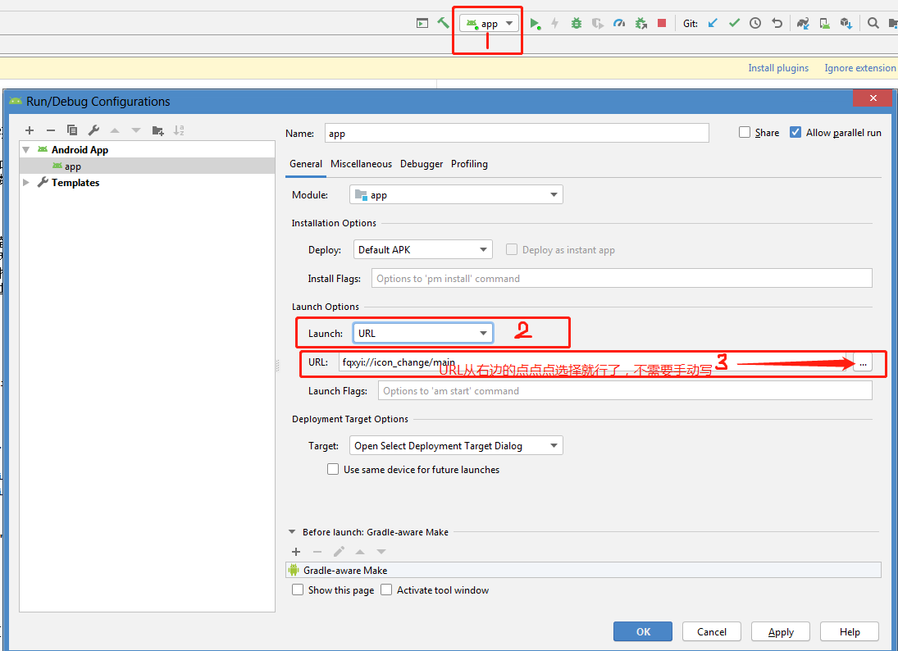

# 动态实现应用ICON切换

## 设计

1. 每次预埋需删除之前预埋的ICON，使用设计提供的新图
2. 存在三种情况：
    - 老版本预埋ICON数量 = 新版本预埋ICON数量，需要执行以下两步：
        - 修改AndroidManifest.xml文件中activity-alias的android:icon值
        - 替换{@link IconChangeManager#getActivityPath}方法中iconType的case值
    - 老版本预埋ICON数量 < 新版本预埋ICON数量，需要执行以下三步：
        - 修改AndroidManifest.xml文件中原有activity-alias的android:icon值，并新增多余的activity-alias节点
        - 为{@link IconChangeManager#ACTIVITY_PATH_ARR}添加新增activity-alias的name
        - 替换{@link IconChangeManager#getActivityPath}方法中iconType的case值，并新增多余的case
    - 老版本预埋ICON数量 > 新版本预埋ICON数量，需要执行以下两步：
        - 修改AndroidManifest.xml文件中原有activity-alias的android:icon值，多余的activity-alias节点`不能删除`
        - 替换{@link IconChangeManager#getActivityPath}方法中iconType的case值，并`删除`多余的case

## 目的

1. 为了解决活动开始的时候，不通过发版本实现应用图标的切换。
2. 减少冗余代码。大多数情况下`老版本预埋ICON数量 = 新版本预埋ICON数量`，所以AndroidManifest.xml文件中只需要一个activity-alias节点即可。

## 局限

1、在AndroidManifest.xml文件中，activity-alias必须要定义在targetActivity后面

2、只能替换预埋在应用内的icon，不能替换网络图片；

是因为图片只能在AndroidManifest.xml文件中引用，不能通过代码动态设置。

4、建议在应用退出的时候更换icon（这是我目前能想到的最合理的方式）；

原因一：系统刷新icon时间较长，此时若返回到桌面（比如说按Home键），点击应用图标会提示`应用未安装`；

原因二：系统刷新icon时间较长，若应用一直保持在前台，可能（部分设备/部分场景）存在过了一段时间之后应用被杀死；

~~4、icon切换为activity-alias标签中指定的图片后，AndroidStudio不能运行安装。需要切回activity标签中指定的图片，才可以运行安装；~~

解决方案：

4.1、在AndroidManifest.xml文件中为activity和activity-alias设置scheme，例如：

```xml
<intent-filter>
    <action android:name="android.intent.action.VIEW" />

    <category android:name="android.intent.category.DEFAULT" />
    <category android:name="android.intent.category.BROWSABLE" />

    <data
        android:host="app"
        android:path="/main"
        android:scheme="androidlearn" />
</intent-filter>
```

4.2、打开Run/Debug Configurations弹框，修改General页面中的Launch Options，详细请看图：



5、AndroidManifest.xml文件中添加过activity-alias标签之后，下一版本不能删除，`可能`会导致应用升级异常：

以工程中的activity（MainActivity），activity-alias（activityAlias、activityAlias2）为例，且在升级包中删除了activity-alias（activityAlias2），则会有以下两种情况：

情况一：已安装应用的enable activity非activityAlias2，为MainActivity或activityAlias，则能正常升级；

情况二：已安装应用的enable activity为activityAlias2，升级完成后桌面上将找不到该应用，通过`设置`界面可以搜索到该应用的应用信息。

结论：一旦在AndroidManifest.xml文件中定义过activity-alias，`建议不要删除`。

# 参考文章

- [activity-alias](https://developer.android.com/guide/topics/manifest/activity-alias-element)
- [Android动态修改应用图标和名称](https://juejin.im/post/5c36f2226fb9a049b7809170)